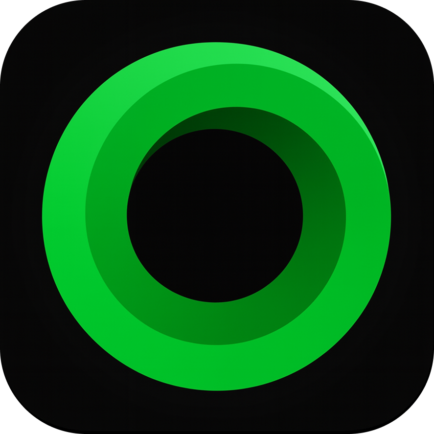
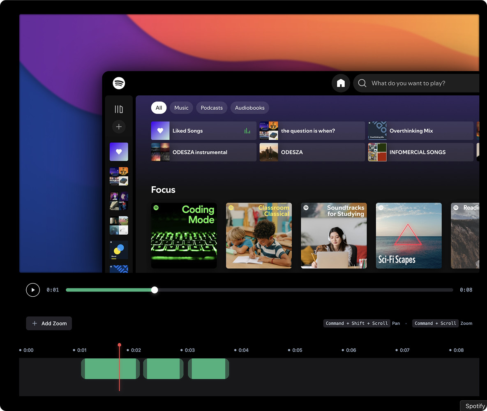
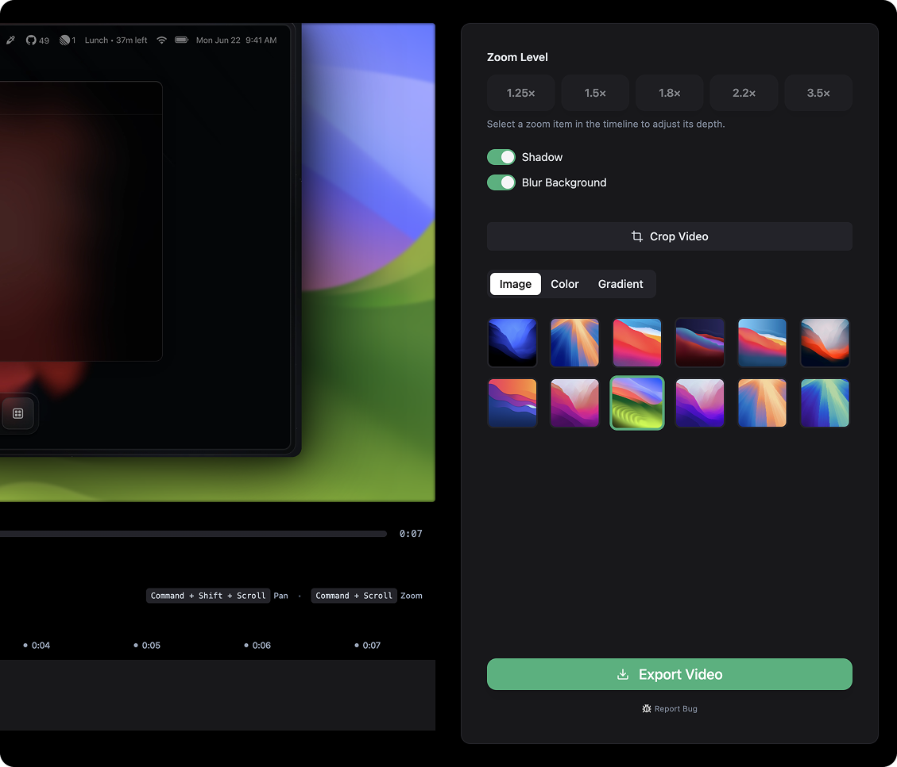
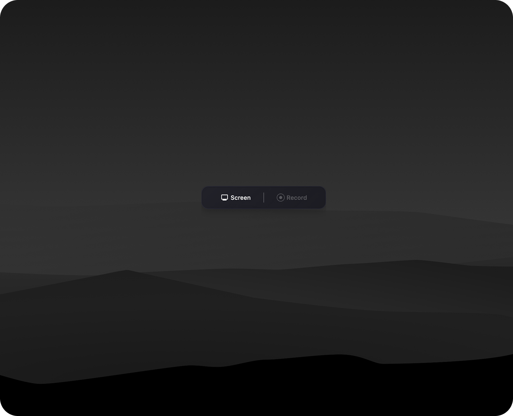

	

# 
OpenScreen

<strong>OpenScreen is your free, open-source alternative to Screen Studio (sort of).</strong>

If you don't want to pay $29/month for Screen Studio but want a much simpler version that does what most people seem to need, making beautiful product demos and walkthroughs, here's a free-to-use app for you. OpenScreen does not offer all Screen Studio features, but covers the basics well!

Okay, let's be real: Screen Studio is an awesome product and this is definitely not a 1:1 clone. OpenScreen is a much simpler take, just the basics for folks who want control and don't want to pay. If you need all the fancy features, your best bet is to support Screen Studio (they really do a great job, haha). But if you just want something free (no gotchas) and open, this project does the job!

OpenScreen is 100% free for personal and commercial use. Use it, remix it, build on it. (Just be cool and give a shoutout if you feel like it!)

**⚠️ DISCLAIMER: This is very much in beta and might be buggy here and there (but hope you have a good experience!).**

	
	
	

## Core Features
- Record your whole screen or specific apps
- Add manual zooms (customizable depth levels)
- Customize the duration and position of zooms however you please
- Crop video recordings to hide parts
- Choose between wallpapers, solid colors, or gradients for your background
- Motion blur and exponential easing for smoother pan and zoom effects

**Note:**
- OpenScreen is designed to support both Windows and macOS. We did not use any native APIs specific to one OS, so it should work on both. However, it hasn't been fully tested on Windows yet, if you run into issues, please let me know!
- After you install the app, you'll need to grant it accessibility and screen recording permissions for it to work properly.

**Contribution:**
Planning to add a contribution guide soon so people can contribute to this repo. Stay tuned!

## Getting Started
Download the latest installer for your platform from the [GitHub Releases](https://github.com/siddharthvaddem/openscreen/releases) page.

## Stack
- Electron
- React
- TypeScript
- Vite
- PixiJS

---

_I'm new to open source, idk what I'm doing lol. If something is wrong please raise an issue 🙏_

## License
MIT License: You can use, modify, and distribute this software for any purpose, including commercial use, without restriction. See the LICENSE file for details.
